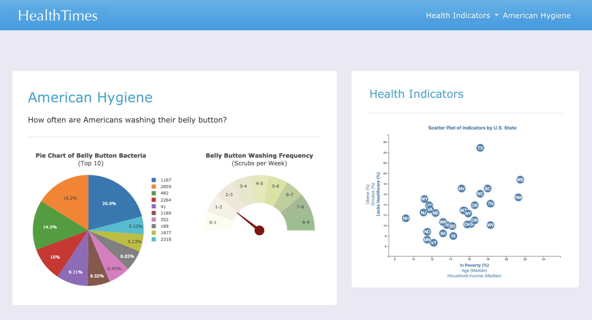
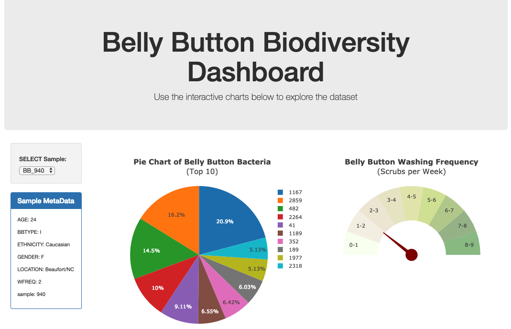
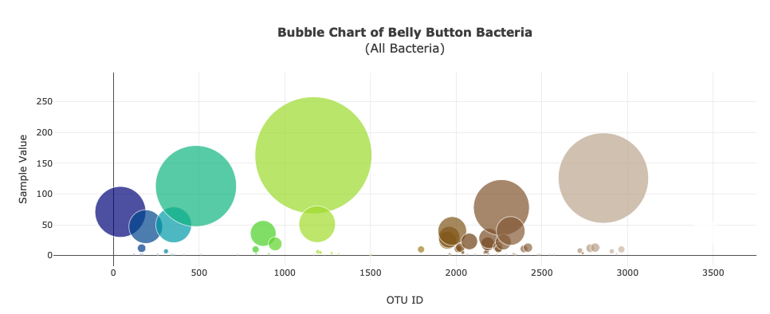
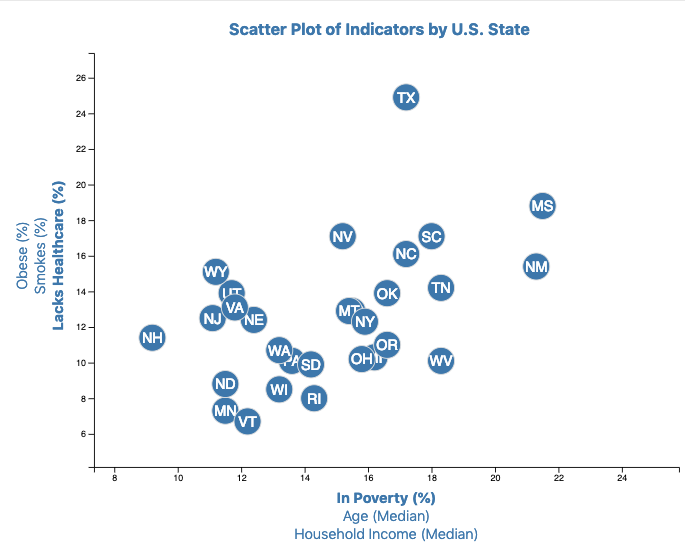
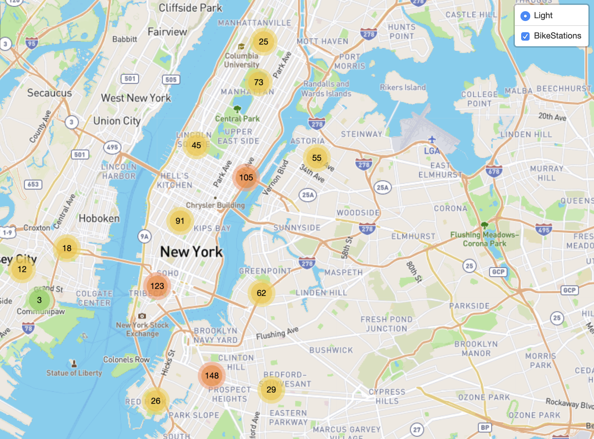
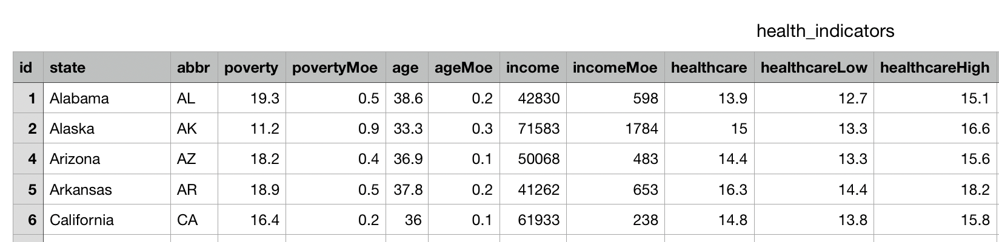
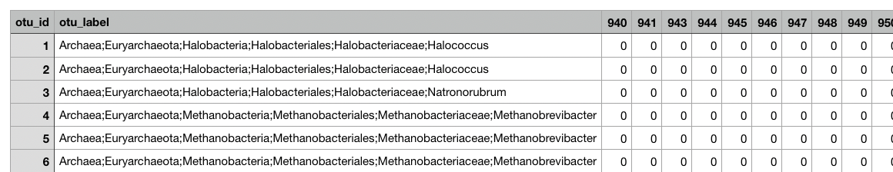
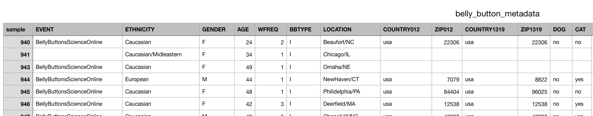

# Data Visualization
   
<strong>Please view my completed website at this link: 
  - [https://sunil-health-visualization.herokuapp.com/](https://sunil-health-visualization.herokuapp.com/)</strong>
  

## Health - Visualization (D3.js, Leaflet.js, Plotly.js, Flask, SQLite, Heroku)

### 1. Summary
My Health - Visualization Website will host four pages:
1. Homepage with two links (Belly Button Hygiene & Health Indicators) w/ a navigation bar.
2. Belly Button Hygiene Dashboard
3. Correlation Plot of Health Indicators
4. Leaflet Map with Layers of Health Indicators

### 2. Screenshot of the final design
 

### 3. Screenshots of relevant visuals that framed my creative folder
 
 
 
 

### 4. [Sample dataset](./DataSets) Screenshots of metadata
 
 
 